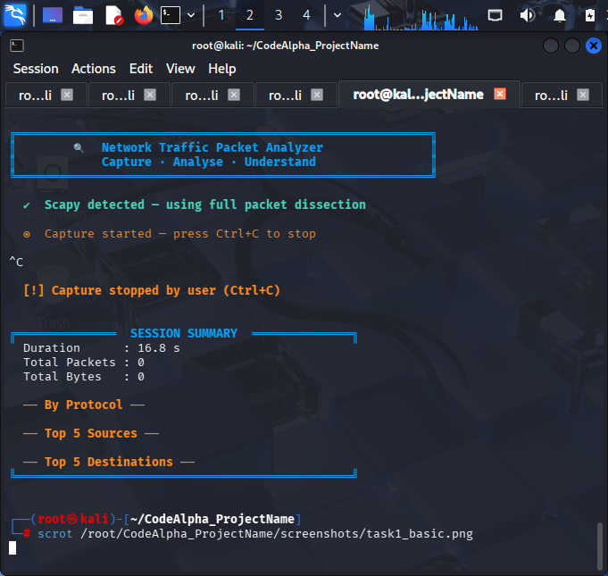
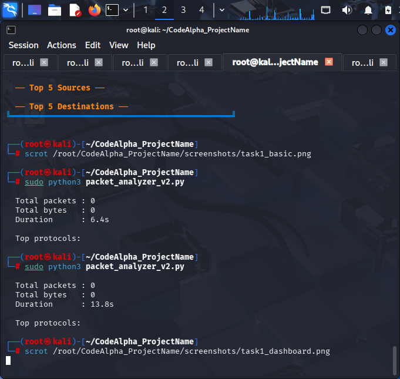
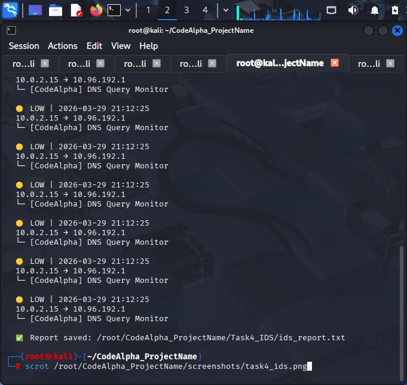
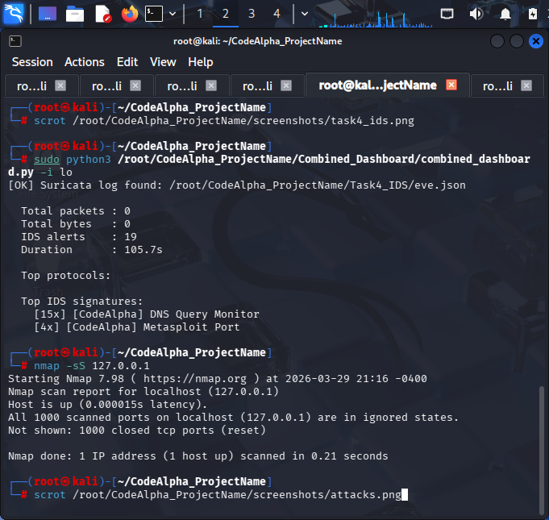

# 🛡️ CodeAlpha Cybersecurity Internship — Advanced Network Monitoring Suite

<div align="center">


**Intern:** Sumeer Singh Rana
**Domain:** Cyber Security
**Company:** CodeAlpha
**Platform:** Kali Linux

</div>

---

## 🚀 Overview

This repository contains a **complete network monitoring and threat detection system** built during my cybersecurity internship.

It combines:

* 🔍 **Packet Sniffing (Scapy)**
* 🚨 **Intrusion Detection System (Suricata)**
* 🖥️ **Terminal Dashboards (Curses)**
* 🌐 **Web Dashboard v4 (Flask — NEW)**

👉 Together, these form a **real-time security monitoring platform** similar to professional SOC tools.

---

## 🧠 Key Features

* 📡 Live packet capture & protocol analysis
* 🚨 Real-time attack detection using Suricata
* 📊 Visual dashboards (Terminal + Web UI)
* 🧵 Multi-threaded real-time processing
* 🔐 Detection of:

  * Port scans
  * Brute force attacks
  * DoS attacks
  * Web attacks (SQLi, XSS)
* 🌐 **NEW: Browser-based Dashboard (v4)**

---

## 📁 Project Structure

```
CodeAlpha_ProjectName/
│
├── packet_analyzer.py
├── packet_analyzer_v2.py
│
├── Combined_Dashboard/
│   └── combined_dashboard.py
│
├── Dashboard_v4/          ⭐ NEW
│   ├── app.py             # Flask backend
│   └── templates/
│       └── index.html     # Web dashboard UI
│
├── Task4_IDS/
│   ├── ids_dashboard.py
│   ├── codealpha.rules
│   ├── eve.json
│   └── ids_report.txt
│
└── screenshots/
```

---

## 🔍 Task 1 — Network Packet Analyzer

### Features

* Live packet capture using Scapy
* Protocol detection (TCP, UDP, DNS, HTTP, HTTPS, ICMP, etc.)
* Deep packet inspection
* Port scan detection
* Real-time statistics

### Run

```bash
sudo python3 packet_analyzer.py
sudo python3 packet_analyzer_v2.py
```

---

## 🚨 Task 4 — Intrusion Detection System

### Features

* Powered by Suricata
* 23 custom rules
* Detects:

  * Reconnaissance
  * DoS attacks
  * Brute force
  * Web attacks
  * Malware activity
* JSON logging + alert dashboard

### Run

```bash
sudo suricata -c /etc/suricata/suricata.yaml -i lo -l Task4_IDS/
sudo python3 Task4_IDS/ids_dashboard.py
```

---

## 🖥️ Combined Terminal Dashboard

### Features

* Unified view of sniffer + IDS
* Multi-threaded real-time updates
* 5 interactive tabs
* Keyboard navigation

### Run

```bash
sudo python3 Combined_Dashboard/combined_dashboard.py -i lo
```

---

## 🌐 Dashboard v4 — Web-Based Monitoring (NEW 🚀)

> A modern **Flask-powered web dashboard** for real-time visualization.

### ✨ Features

* 🌍 Runs in browser (`localhost:5000`)
* 📊 Live traffic monitoring
* 🚨 IDS alerts visualization
* 🧠 Clean UI using HTML templates
* 🔄 Auto-refreshing data
* 📈 Easy to extend (charts, graphs, APIs)

### ▶️ Run

```bash
cd Dashboard_v4
python3 app.py
```

Then open:

```
http://127.0.0.1:5000
```

---

## ⚙️ Installation

### 1. Clone Repo

```bash
git clone https://github.com/Singh847/CodeAlpha_ProjectName.git
cd CodeAlpha_ProjectName
```

### 2. Install Dependencies

```bash
pip3 install scapy flask --break-system-packages
```

### 3. Install Suricata

```bash
sudo apt update
sudo apt install suricata nmap -y
```

---

## ⚡ Quick Demo

```bash
# Terminal 1 — Start IDS
sudo suricata -c /etc/suricata/suricata.yaml -i lo -l Task4_IDS/

# Terminal 2 — Start Web Dashboard
cd Dashboard_v4
python3 app.py

# Terminal 3 — Generate traffic
nmap -sS 127.0.0.1
ping -c 20 127.0.0.1
```

---

## 💥 Attack Simulation Commands

```bash
nmap -sS 127.0.0.1
nmap -sN 127.0.0.1
ping -c 100 127.0.0.1

curl "http://localhost/?id='+OR+'1'='1"
curl "http://localhost/?q=<script>alert(1)</script>"
```

---

## 📚 What I Learned

* Network packet analysis (TCP/IP)
* Real-time monitoring using Scapy
* IDS rule creation with Suricata
* Threat detection techniques
* Multi-threaded Python applications
* Terminal UI (curses)
* 🌐 **Flask web development (Dashboard v4)**
* Security visualization & logging

---

## 🎯 Future Improvements

* 📊 Add charts (Chart.js / Plotly)
* 🔔 Real-time alerts (WebSockets)
* ☁️ Deploy dashboard on AWS
* 📡 Remote monitoring support
* 🔐 Authentication for dashboard

---

## 📸 Screenshots

* Packet Analyzer
* IDS Dashboard
* Combined Dashboard
* Web Dashboard v4

---

## 📞 Contact

* 🌐 [www.codealpha.tech](http://www.codealpha.tech)
* 📧 [services@codealpha.tech](mailto:services@codealpha.tech)

---

⭐ *This project demonstrates a complete hands-on cybersecurity monitoring system from packet capture to web-based visualization.*
---

## 📸 Screenshots

### 🔍 Task 1 — Basic Network Sniffer


---

### 🖥️ Task 1 — Advanced TUI Dashboard


---

### 🚨 Task 4 — IDS Dashboard (Suricata)


---

### 💥 Attack Simulations

```

---

## 👉 STEP 4 — Save & Exit
```
Ctrl+O → Enter → Ctrl+X
